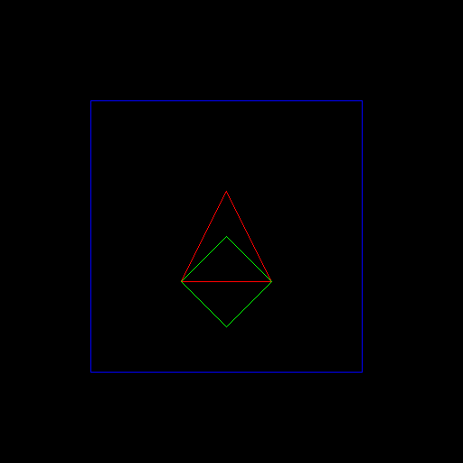
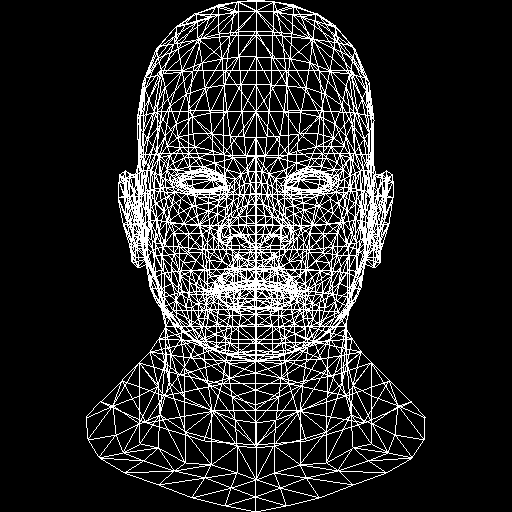
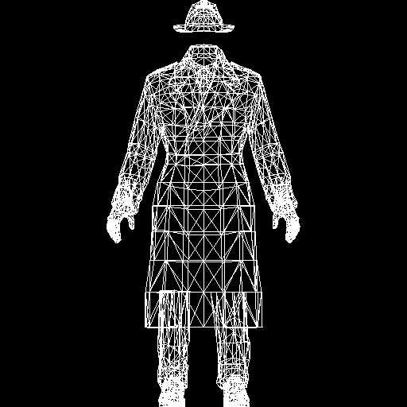
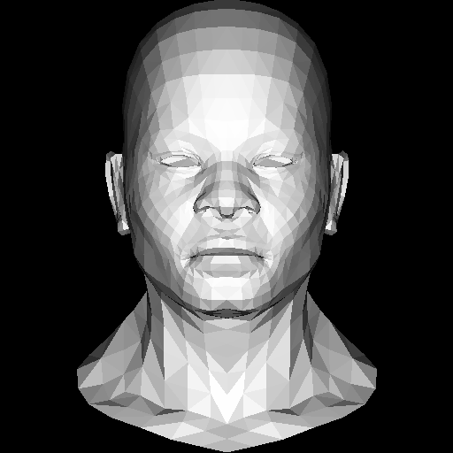
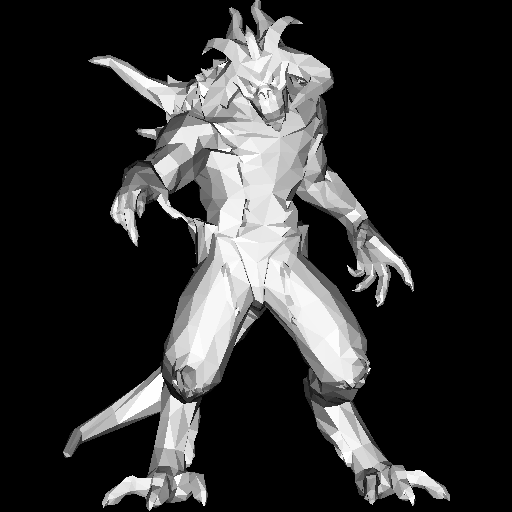
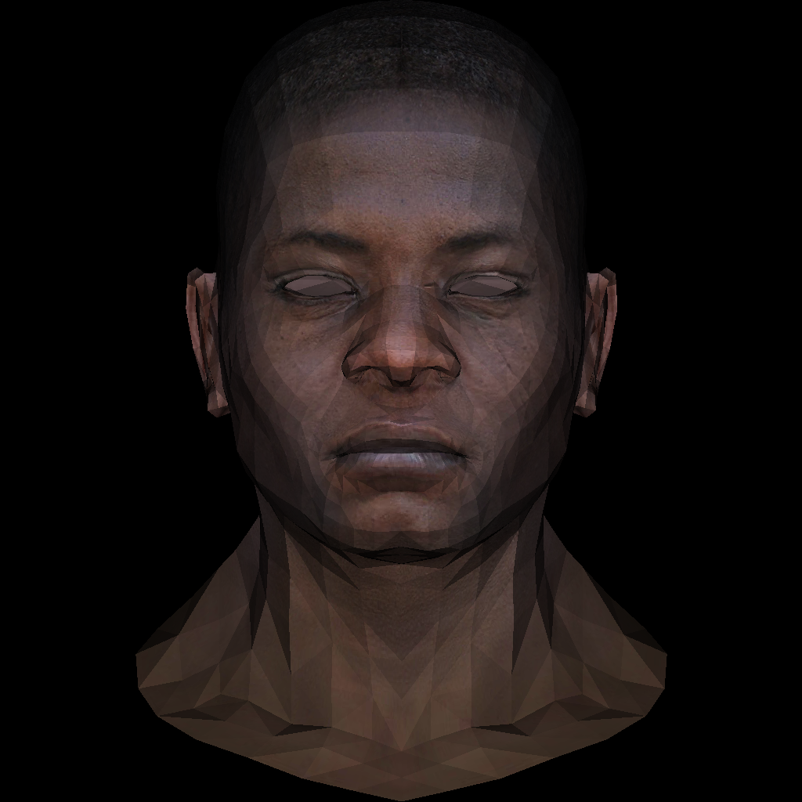
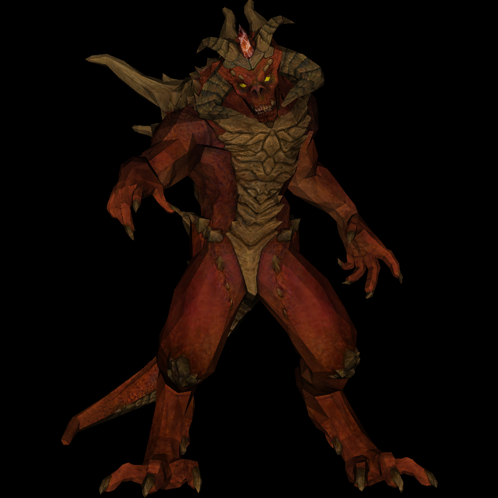

# SoftRasterizationRenderer
不依赖第三方库的软件的光栅化渲染器
## ① 画线
对于给定两个点，我们需要画出两点形成的线段，像素是离散的，这就需要在两个点之间画上足够的点，取Δx和Δy中的较大者为采样率
```c++
void line(int x0, int y0, int x1, int y1, TGAImage &image, TGAColor color) {
    bool xToy = false;
    if (std::abs(x0 - x1) < std::abs(y0 - y1)) {
        std::swap(x0, y0);
        std::swap(x1, y1);
        xToy= true;
    }
    if (x0 > x1) {
        std::swap(x0, x1);
        std::swap(y0, y1);
    }
    for (int i = 0; i <= x1 - x0; i++) {
        int x = x0 + i;
        int y = y0 + (i * 1.0) / (x1 - x0) * (y1 - y0);
        if (xToy)
            image.set(y, x, color);
        else
            image.set(x, y, color);
    }
}
```
绘制一些简单的几何图形
```c++
    TGAImage image(512, 512, TGAImage::RGB);
// 绘制红色正方形
    line(100, 100, 100, 400, image, {255, 0, 0, 255});
    line(100, 400, 400, 400, image, {255, 0, 0, 255});
    line(400, 400, 400, 100, image, {255, 0, 0, 255});
    line(400, 100, 100, 100, image, {255, 0, 0, 255});
// 绘制蓝色三角形
    line(200, 200, 300, 200, image, {0, 0, 255, 255});
    line(300, 200, 250, 300, image, {0, 0, 255, 255});
    line(250, 300, 200, 200, image, {0, 0, 255, 255});
// 绘制绿色菱形
    line(250, 150, 300, 200, image, {0, 255, 0, 255});
    line(300, 200, 250, 250, image, {0, 255, 0, 255});
    line(250, 250, 200, 200, image, {0, 255, 0, 255});
    line(200, 200, 250, 150, image, {0, 255, 0, 255});
    image.write_tga_file("result.tga");
    return 0;
```

## ② 读取模型文件
二维向量的运算
```c++
template<class T>
struct Vector2 {
    T x, y;
    Vector2() : x(0), y(0) {}
    Vector2(T x, T y) : x(x), y(y) {}
    Vector2<T> operator+(const Vector2<T> V) const {
        return Vector2<T>(x + V.x, y + V.y);
    }
    Vector2<T> operator-(const Vector2<T> V) const {
        return Vector2<T>(x - V.x, y - V.y);
    }
    Vector2<T> operator*(float k) const {
        return Vector2<T>(x * k, y * k);
    }
};
typedef Vector2<float> Vec2f;
typedef Vector2<int> Vec2i;
```
三维向量的运算
```c++
template<class T>
struct Vector3 {
    T x, y, z;
    Vector3() : x(0), y(0), z(0) {}
    Vector3(T _x, T _y, T _z) : x(_x), y(_y), z(_z) {}
    Vector3<T> operator^(const Vector3<T> &v) const {
        return Vector3<T>(y * v.z - z * v.y, z * v.x - x * v.z, x * v.y - y * v.x);
    }
    Vector3<T> operator+(const Vector3<T> &v) const { return Vector3<T>(x + v.x, y + v.y, z + v.z); }
    Vector3<T> operator-(const Vector3<T> &v) const { return Vector3<T>(x - v.x, y - v.y, z - v.z); }
    Vector3<T> operator*(float f) const { return Vector3<T>(x * f, y * f, z * f); }
    T operator*(const Vector3<T> &v) const { return x * v.x + y * v.y + z * v.z; }
    float norm() const { return std::sqrt(x * x + y * y + z * z); }
    Vector3<T> &normalize(T l = 1) {
        *this = (*this) * (l / norm());
        return *this;
    }
};
typedef Vector3<float> Vec3f;
typedef Vector3<int> Vec3i;
```
### 读取模型文件
这里先只读取模型的三角形坐标，纹理和法线后面再用
```c++
class Model {
public:
    std::vector<Vec3f> vertexes; // 存储顶点坐标
    std::vector<std::vector<int> > triangles; // 存储三角形的顶点索引
    explicit Model(const char *filename);
    ~Model();
};
```
记录顶点坐标和三角形的顶点索引，模型文件中的索引从1开始
```c++
    std::string line;
    while(!in.eof()){
        std::getline(in,line);
        std::istringstream iss(line);
        char trash;
        if(!line.compare(0,2,"v ")){
            iss>>trash; // 忽略字符v
            Vec3f vertex;
            iss>>vertex.x>>vertex.y>>vertex.z;
            vertexes.push_back(vertex);
        }else if(!line.compare(0,2,"f ")){
            iss>>trash; // 忽略字符f
            std::vector<int>triangle;
            int vIndex,tIndex,nIndex; // 顶点坐标索引、纹理坐标索引、面法线坐标索引
            while(iss>>vIndex>>trash>>tIndex>>trash>>nIndex){ // 忽略字符/
                vIndex--;
                triangle.emplace_back(vIndex);
            }
            triangles.push_back(triangle);
        }
    }
```
### 世界坐标系转换到屏幕坐标系
模型文件空间为[-1,1]³，屏幕坐标为二维的width×height，这里先直接忽略z坐标，即固定看向-z方向，x和y先+1转正后除以2乘以宽高
```c++
    int width=512,height=512;
    TGAImage image(width, height, TGAImage::RGB);
    Model model("C:\\Users\\v_maolinye\\Desktop\\SoftRasterizationRenderer\\obj\\african_head.obj");
    for(auto&triangle:model.triangles){
        for(int i=0;i<3;i++){
            auto v0=model.vertexes[triangle[i]];
            auto v1=model.vertexes[triangle[(i+1)%3]];
            int x0=(v0.x+1)*width/2;
            int y0=(v0.y+1)*height/2;
            int x1=(v1.x+1)*width/2;
            int y1=(v1.y+1)*height/2;
            line(x0,y0,x1,y1,image,{255,255,255,255});
        }
    }
    image.write_tga_file("result.tga");
    return 0;
```


## ③ 平面着色 Z-buffer深度缓冲
即给三角形内的点上色，games101里面通过叉乘来判断一个点是否在一个多边形内部，如果AP×AB和BP×BC和CP×CA的方向是一样的，那么这个P点就在三角形内部，为了方便后续计算，这里使用计算点的重心坐标来判断点是否在三角形内，如果计算出来的重心坐标非负说明点在三角形内，这里使用简化的三角形面积比来计算重心坐标
```c++
std::tuple<float, float, float> computeBarycentric2D(float x, float y, Vector3f *v){
    float c1 = (x*(v[1].y - v[2].y) + (v[2].x - v[1].x)*y + v[1].x*v[2].y - v[2].x*v[1].y) / (v[0].x*(v[1].y - v[2].y) + (v[2].x - v[1].x)*v[0].y + v[1].x*v[2].y - v[2].x*v[1].y);
    float c2 = (x*(v[2].y - v[0].y) + (v[0].x - v[2].x)*y + v[2].x*v[0].y - v[0].x*v[2].y) / (v[1].x*(v[2].y - v[0].y) + (v[0].x - v[2].x)*v[1].y + v[2].x*v[0].y - v[0].x*v[2].y);
    float c3 = (x*(v[0].y - v[1].y) + (v[1].x - v[0].x)*y + v[0].x*v[1].y - v[1].x*v[0].y) / (v[2].x*(v[0].y - v[1].y) + (v[1].x - v[0].x)*v[2].y + v[0].x*v[1].y - v[1].x*v[0].y);
    return {c1,c2,c3};
}
```
用一个矩形框作为三角形的包围盒，遍历包围盒里面的像素是否在三角形内，并使用深度缓冲来更新像素的深度
```c++
void triangle(Vector3f*v,float*depth_buffer,TGAImage&image,TGAColor color){
    int minx=std::min(v[0].x,std::min(v[1].x,v[2].x));
    int miny=std::min(v[0].y,std::min(v[1].y,v[2].y));
    int maxX=std::max(v[0].x,std::max(v[1].x,v[2].x));
    int maxY=std::max(v[0].y,std::max(v[1].y,v[2].y));
    for(int x=minx;x<=maxX;x++){
        for(int y=miny;y<=maxY;y++){
            auto[alpha, beta, gamma] = computeBarycentric2D(x,y,v);
            if(alpha>=0&&beta>=0&&gamma>=0){
                float depth=alpha*v[0].z+beta*v[1].z+gamma*v[2].z;
                if(depth>depth_buffer[x*width+y]){
                    depth_buffer[x*width+y]=depth;
                    image.set(x,y,color);
                }
            }
        }
    }
}
```
增加坐标转换和叉乘函数
```c++
Vector3f mvp(Vector3f v){
    return {(v.x+1)/2*width,(v.y+1)/2*height,v.z};
}
Vector3f crossProduct(Vector3f v1,Vector3f v2){
    return {v1.y*v2.z - v1.z*v2.y, v1.z*v2.x - v1.x*v2.z, v1.x*v2.y - v1.y*v2.x};
}
```
固定光照，计算每个三角形面的法线，计算高光
```c++
    width=512,height=512;
    TGAImage image(width, height, TGAImage::RGB);
    Model model(R"(C:\Users\v_maolinye\Desktop\SoftRasterizationRenderer\obj\african_head.obj)");
    auto*depth_buffer=new float[width*height];
    for(int i=0;i<width*height;i++){
    depth_buffer[i]=-std::numeric_limits<float>::max();
    }
    Vector3f light_direction(0,0,-1);
    for(auto&t:model.triangles){
    Vector3f v[3],mvp_v[3];
    for(int i=0;i<3;i++){
    v[i]=model.vertexes[t[i]];
    mvp_v[i]= mvp(v[i]);
    }
    Vector3f normal= crossProduct(v[2]-v[0],v[1]-v[0]);
    float light_intensity=normal.normalize()*light_direction;
    if(light_intensity<0)
    light_intensity=-light_intensity;
    std::uint8_t color=light_intensity * 255;
    triangle(mvp_v,depth_buffer,image,{color,color,color, 255});
    }
    image.write_tga_file("result.tga");
    return 0;
```


## ④ 纹理映射
增加读取模型中的纹理坐标，需要将坐标恢复到width×height空间
```c++
void Model::load_texture(const char *filename) {
    texture_image.read_tga_file(filename);
    texture_image.flip_vertically();
    int width=texture_image.width(),height=texture_image.height();
    for(auto&one:textures){
        one.x=one.x*width;
        one.y=one.y*height;
    }
}
```
只有顶点的纹理坐标，三角形内点需要通过重心坐标插值计算
```c++
            auto[alpha, beta, gamma] = computeBarycentric2D(x,y,v);
            if(alpha>=0&&beta>=0&&gamma>=0){
                float depth=alpha*v[0].z+beta*v[1].z+gamma*v[2].z;
                if(depth>depth_buffer[x*width+y]){
                    depth_buffer[x*width+y]=depth;
                    Vector2f uv=texture_uv[0]*alpha+texture_uv[1]*beta+texture_uv[2]*gamma;
                    TGAColor color=texture_image.get(uv.x,uv.y);
                    image.set(x,y,color*l_i);
                }
            }
```
使用
```c++
    width=1024,height=1024;
    TGAImage image(width, height, TGAImage::RGB);
    Model model(R"(C:\Users\v_maolinye\Desktop\SoftRasterizationRenderer\obj\diablo3_pose.obj)");
    model.load_texture(R"(C:\Users\v_maolinye\Desktop\SoftRasterizationRenderer\texture\diablo3_pose_diffuse.tga)");
    auto*depth_buffer=new float[width*height];
    for(int i=0;i<width*height;i++){
        depth_buffer[i]=-std::numeric_limits<float>::max();
    }
    Vector3f light_direction(0,0,-1);
    for(int j=0;j<model.triangles.size();j++){
        Vector3f v[3],mvp_v[3];
        Vector2f uv[3];
        for(int i=0;i<3;i++){
            v[i]=model.vertexes[model.triangles[j][i]];
            mvp_v[i]= mvp(v[i]);
            uv[i]=model.textures[model.triangles_textures[j][i]];
        }
        Vector3f normal= crossProduct(v[2]-v[0],v[1]-v[0]);
        float light_intensity=normal.normalize()*light_direction;
        if(light_intensity>0)
        triangle(mvp_v,depth_buffer,image,light_intensity,uv,model.texture_image);
    }
    image.write_tga_file("result.tga");
    return 0;
```

